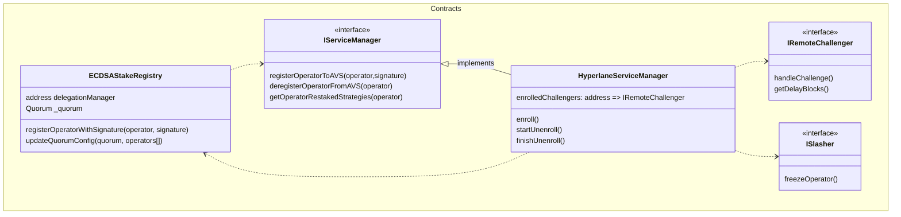
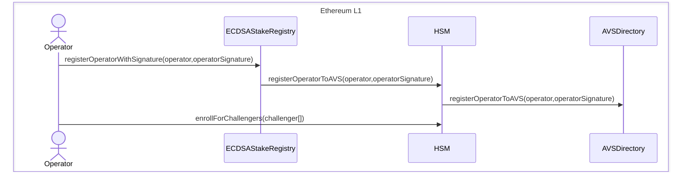
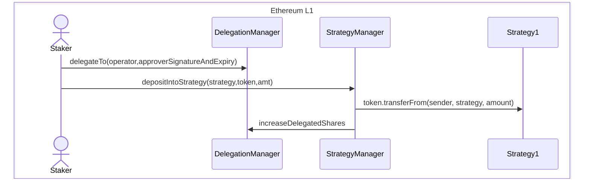
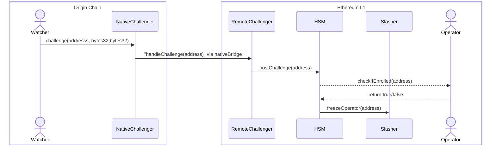

# Hyperlane AVS v1

### Goal

This HIP proposes a design for the Hyperlane AVS building on top of Eigenlayer protocol to utilitise the economic security for messages outbound from Ethereum and subsequently its rollups. Currently, this proposal comprises of the following functions:

- Allow eigenlayer operators to register/deregister themselves to the AVS as validators for any chain
  - Creating hyperlaneAVS contract
  - Modify validator client to produce ECDSA stake registry signature and post to s3 (like validator announce)
  - CLI command to register/deregister operator to AVS - ask EL if they support registering on arbitrary stakeRegistry or do we need to add this to the CLI
- Allow stakers to delegate their stake to the operators for the specific strategy.
  - Configure and deploy the strategy contracts manually.
- Anticipate non-eigenlayer staking.
- Anticipate permissionless slashing of opt-in operators by the ISM
- Enable easy management of staked operators and maintain availability of operators for the ISMs - OOS

**Architecture**

WIP



**Interface**

```solidity
contract HyperlaneAVS is IServiceManager, OwnableUpgradeable {
    IStakeRegistry internal immutable stakeRegistry;
    IAVSDirectory internal immutable _avsDirectory;
    mapping(address => EnumerableMap.AddressToBool (IChallenger => bool)) internal enrolledChallengers;


    modifier onlyStakeRegistry() {
        require(msg.sender == address(stakeRegistry);
        _;
    }

    function registerOperatorToAVS(
        address operator,
        ISignatureUtils.SignatureWithSaltAndExpiry memory operatorSignature
    ) public virtual onlyStakeRegistry {
        _avsDirectory.registerOperatorToAVS(operator, operatorSignature);
    }

    function deregisterOperatorFromAVS(address operator) public virtual onlyStakeRegistry {
        _avsDirectory.deregisterOperatorFromAVS(operator);
    }

    function enrollIntoChallengers(IChallenger challengers[]) public virtual {
        for (uint256 i = 0; i < challengers.length; i++) {
            enrolledChallengers[operator][challengers[i]] = ENROLLED;
        }
    }

    function startUnenrollmentFromChallengers(IChallenger challengers[]) public virtual {
        for (uint256 i = 0; i < challengers.length; i++) {
            enrolledChallengers[operator][challengers[i]] = UNENROLLMENT_QUEUE;
        }
    }

    function finishUnenrollmentFromChallengers(IChallenger challengers[]) public virtual {
        for (uint256 i = 0; i < challengers.length; i++) {
            // check for delayed blocks
            enrolledChallengers[operator][challengers[i]] = UNENROLLED;
        }
    }

}
```

Q. the stakeRegistry has a single thresholdWeight, totalWeight for the AVS which is used for \_validateThresholdState

Q. threshold weight is 66% of the total? - not relevant

Q. updating operator weights?

### Workflow for registering

PREREQ: registered as an Eigenlayer Operator (through their CLI)



Notes:

We need operators to enroll into specific challengers to allow for permissionless slashing by any ISM deployers. As an operator, you can inspect every remote challenger and choose for yourself which ones you want to opt into depending on risk vs reward. This also means Abacus Works won't be the bottleneck for adding challengers for different rollup stacks. The operators will be able to unenroll after the unenrollment delay blocks has passed.

TODO: workflow for deregistering

### Workflow for staking



Notes:

- Strategy1, Strategy2, etc will be deployed by Abacus Works (but written by EL)
- Replace `StrategyManager` by `EigenPodManager` and you get the same flow for native restaking
- Delegation is all-or-nothing: when a Staker delegates to an Operator, they delegate ALL their shares.
- If the operator has a `delegationApprover`, the caller MUST provide a valid `approverSignatureAndExpiry` and `approverSalt`.
- the deposit function can also be called by way of a signature by anyone besides the staker (esp operator) [more details]()

### Workflow for ISMs

- select and update restaked validators in your ISM manually.

### Workflow for slashing



**Interface**

```solidity
interface IRemoteChallenger extends MailboxClient {
    uint256 unenrollmentDelyaedBlocks = 50400;
    function handleChallenge(address operator) external;
}
```

- Let's assume an operator signs up for a specific IChallenger[] list which includes (say rollupA remote challenger).
- A watcher will call the INativeChallenger from the destination chain where the double signing was detected. It checks the signed root against the correct root and if it doesn't match the correct root, it will calls the remoteChallenger on the L1 via the native bridge.
- The remoteChallenger calls the serviceManager which calls the slasher.
- The serviceManager checks if the operator is registered for the challenger and if it is, it calls the slasher to slash the operator.

### Workflow for deploying Hyperlane and configuring validating on rollupA, rollupB

- deploy ecdsaRegistry

- deploy and config IStrategy with native ETH and configure them to the StrategyManager through addStrategiesToDepositWhitelist

- enable quorum for rollupA, rollupB and set the quorum param for each quorum like maxOperatorCount, minStake, etc and strategy

```
hypAVS = HyperlaneAVS.deploy(owner);
ecdsaRegistry = ECDSARegistry.deploy();

for (domains) {
    ETHstrategy = IStrategy.deploy(manager);
    ETHstrategy.initialize(WETH);
    quorums.push({strategy, 1, [ETHstrategy]});
    ecdsaRegistries.initialize(hypAVS, 6666, quorums);
}

```

Q. From EL (4/10), some of the items for launching mainnet:

1. let us know your hardware requirements for operators, we'll make intros to the Eigen operators to test your software so you can get started this or next week, you need at least 20 Eigen node operators to launch on mainnet and 10 of them overlapping with other AVSs
2. get whitelisted on the testnet frontend
3. Code frozen
4. get avs registry contracts audited
5. Operator ready: tested with Eigen operators, good operator documentation, sufficient operator support ready
6. Lastly, get whitelisted on our mainnet frontend

### Scope for first milestone

- Contracts

  - UML diagrams for contract interactions - 1 day
  - HyperlaneAVS - 1 day
  - tests for mocking eigenlayer contracts in the ServiceManager - 1 day
  - StakeWeightMultisigISM (optional) - OOS
  - General staking interface IStakingManager and loose interactions for native staking, restaking for Karak, etc - OOS

- Agent work

  - Validator client changes for s3 posting - 3 days
  - Full node spec compliance - [link](https://docs.eigenlayer.xyz/category/node-specification) - hardcoded right now - OOS
  - relayer changes for StakeWeightMultisigISM - OOS

- Deployments
  - Holesky deployment of Hyperlane core - 0.5 day
  - CLI command for opt-in/out of AVS - 2 days
  - Deploy the AVS contracts and (configure the AW validators) - 2 days
  - e2e test in CI - OOS
- Guide for operators to (de)register with Hyperlane AVS, node classes/requirements, etc + giving EL the - 1.5 day

**Open questions**

- recording stake globally?
  - punting, solved with the challenger mapping
- churn for operators?
  - MAX_UINT32
- minimum stake requirment for operators?
  - 0
- business questions for the validators?
  - are there requirements from the operator side to be included in the AVS - incentives, etc.

### Appendix

**StakeRegistry**

A quorum is a grouping and configuration of specific kinds of stake that an AVS considers when interacting with Operators. When Operators register for an AVS, they select one or more quorums within the AVS to register for.

Quorums define a maximum Operator count as well as parameters that determine when a new Operator can replace an existing Operator when this max count is reached. These definitions are contained in a quorum's OperatorSetParam, which the Owner can configure via the RegistryCoordinator. A quorum's OperatorSetParam defines both a max Operator count, as well as stake thresholds that the incoming and existing Operators need to meet to qualify for churn.

DelegationManager

"Whereas the EigenPodManager and StrategyManager perform accounting for individual Stakers according to their native ETH or LST holdings respectively, the DelegationManager sits between these two contracts and tracks these accounting changes according to the Operators each Staker has delegated to.

This means that each time a Staker's balance changes in either the EigenPodManager or StrategyManager, the DelegationManager is called to record this update to the Staker's delegated Operator (if they have one). For example, if a Staker is delegated to an Operator and deposits into a strategy, the StrategyManager will call the DelegationManager to update the Operator's delegated shares for that strategy"

How does this impact the fee rewards for the stakers, earn per message and then claim at once?

and minWithdrawalDelayBlocks = 50400 (1 week) for operators for EL M2

**ISM verification cost**

Approximate ECDSA verification cost is 219k for 10/18, 273420k for 18/18. But, we give the ISM the ability to set the threshold for their own quorum so this shouldn't be a problem. Note: revisit.
